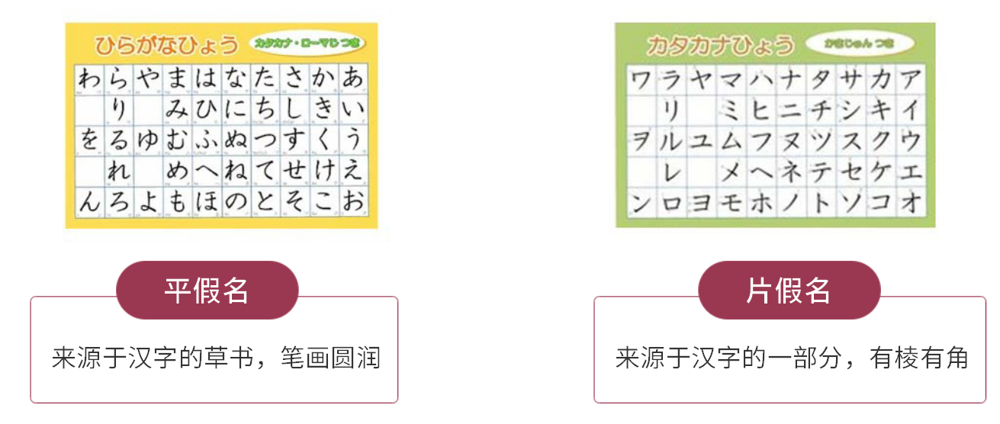
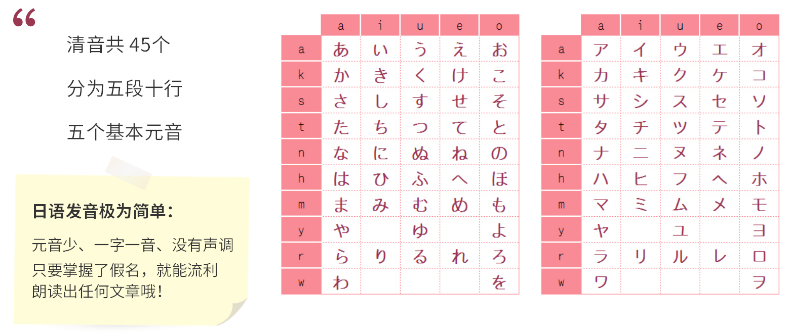

# 课程介绍

> 假名读音
>
> 假名写法
>
> 实用单词
>
> 补充练习

日语=汉字+假名

**日语中的汉字**

中文汉字(繁体字)
与中文汉字稍有区别
日本自创的"国字"

**假名**

假名 : 日本固有的表音文字(假:假借)

**汉字?平假名?片假名?**

汉字：名词;形容词、动词词干

平假名：形容词、动词词尾;助词、副词、助动词;无汉字或汉字难读难写的单词;

片假名：外来语;拟声、拟态词；

**罗马字**

用拉丁字母标注的日语读音

多用于人名、公司名、产品名等

用于日文输入法

### 五十音图

